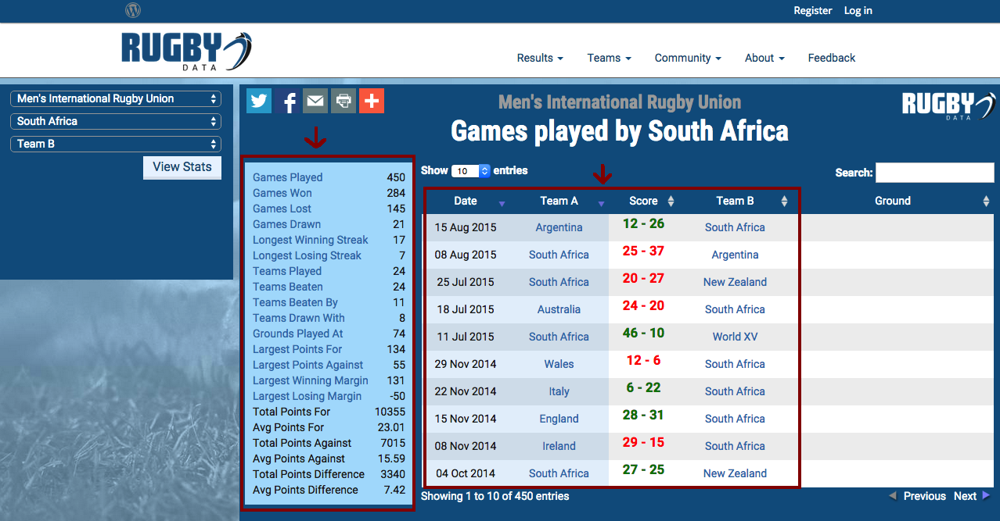
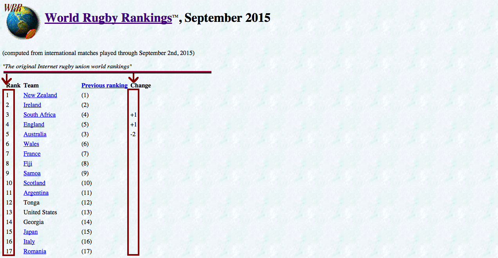
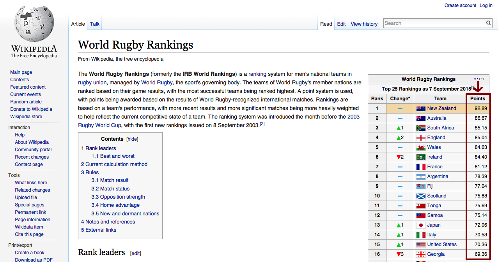
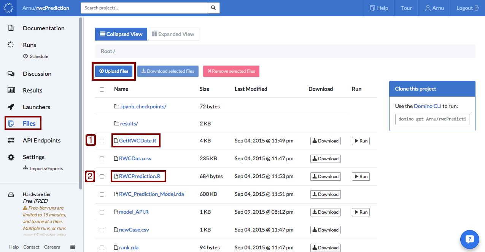
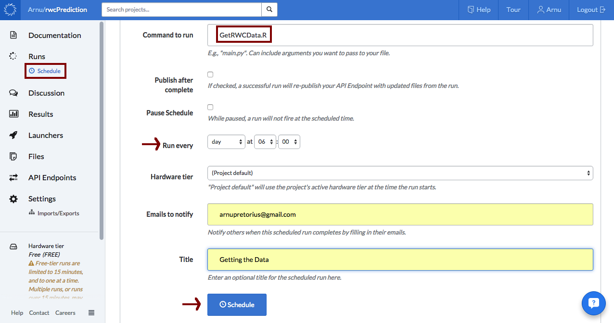
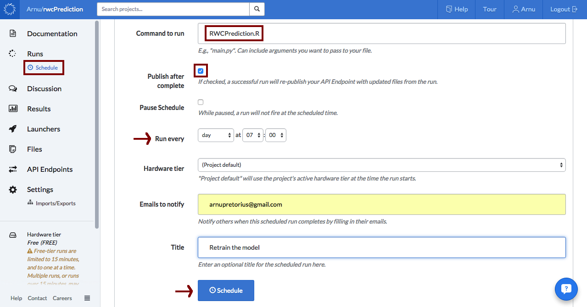
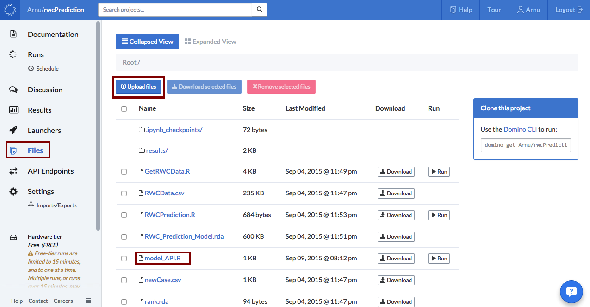
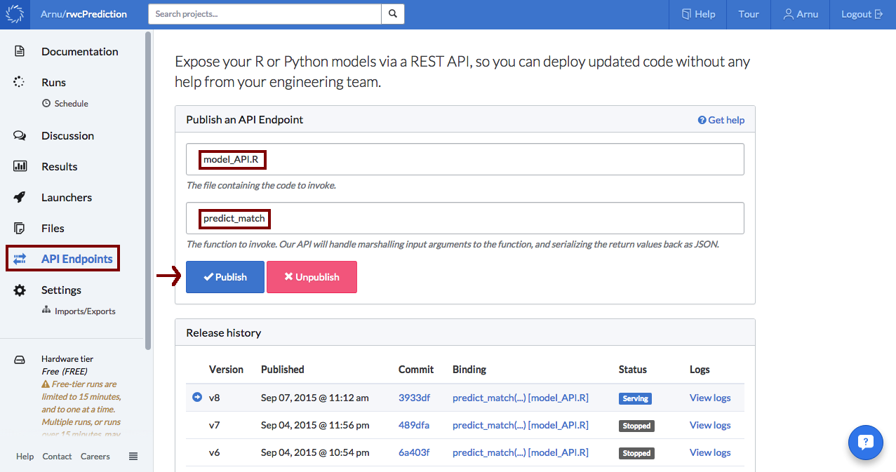

For the sake of brevity, not all the relevant data and code are displayed in this post but can rather be found [here][7]. 

# Introduction

The Rugby World Cup (RWC) is here! With many fans around the world excited to see the action unfold over the next month and a half. 

If you've never heard of the sport, [whatisrugby.com][1] provides the following short description:

> Rugby is a free-flowing game that features a combination of strength, speed and strategy to move a ball into an opponents territory. Rugby is a full-contact sport yet players wear little-or no protective gear. Rugby evolved from football (i.e. soccer) and is often called the 'game played in heaven'.

(Definitely an entertaining sport to watch, but the "game played in heaven"? Probably still up for debate.) 

In this blog post I go through the steps I took to build a machine learning model using [Domino][2] and [R][3] to try predict the outcome of each upcoming RWC match. Don't feel like reading it all? Feel free to skip to what strikes your fancy:

* Part 1: [Getting the data][]
* Part 2: [Exploring the data][]
* Part 3: [Model selection][]
* Part 4: [Automating the process using Domino scheduling][]
* Part 5: [Using Domino API Endpoints for prediction requests][]

Before I go through the specifics, I would just like to mention that the initial idea was to simply get some relevant rugby data from the web, train a model using the data collected and then make predictions. Pretty simple, so lets get started! 

## Getting the data

As with many machine learning undertakings the first step was to collect the data. I found a good source of rugby data at [rugbydata.com][4]. For each of the 20 teams in the RWC I collected some general historical team statistics and past matches stretching back to the beginning of 2013 (shown below for South Africa). 



Only the matches between teams that are actually going to compete in the tournament were kept. In addition, tied matches were discarded. The first reason for this is due to the fact that in rugby a tied match is a fairly rare occurrence. The second, is that I was more concerned with predicting a win or a loss, the outcomes most fans care about, rather than also being able to predict match ties. 

As another data source I collected the rankings of each team as well as their recent change in rank from [this site][5] (shown below).



Finally, connected to team rankings are ranking points that I managed to find on a [world rugby rankings][6] Wikipedia page. 



Since most of the data only reflect the current state of each team's historical performance and rank, weights were computed based on the date of each match (matches are treated as observations) in an attempt to adjust the data to exhibit a more accurate reflection of the past. The entire data collection, cleaning and structuring was done with [code][8] written in R.

## Exploring the data

Now that the data was in the bag, it was time to go explore! As a quick overview of the data I looked at a [heat map of the correlation][13] between all the variables.   

```{r CorrelationHeatMap, cache=TRUE, message=FALSE, warning=FALSE, fig.align='center'}
# load data
data <- readRDS("RWCData.rda")

# Correlation heat map of the training dat
library(ggplot2)
library(reshape2)
dataCor <- data
dataCor <- cbind(as.numeric(data[,1]), as.numeric(data[,2]), as.numeric(data[,3]), 
                 as.numeric(data[,4]), as.numeric(data[,5]), data[,-c(1,2,3,4,5)])

colnames(dataCor) <- colnames(data)
title <- "Rugby training data correlation heat map"
corp <- qplot(x=Var1, y=Var2, data=melt(cor(dataCor, use="p")), fill=value, geom="tile") +
      scale_fill_gradient2(limits=c(-1, 1))
corp <- corp + theme(axis.title.x=element_blank(), axis.text.x=element_blank()
                     , axis.ticks=element_blank())
corp <- corp + ggtitle(title)
corp
```

A dark blue square indicates a strong positive correlation between two variables and a dark red square a strong negative correlation. As I sort of expected many of the variables seemed to be correlated with each other (such as the average points scored against a team at home and the number of games the team lost at home). Nevertheless, in the first column of the heat map I was able find the degree of correlation between all the variables (indexed by the rows) with the outcome of the match. The rank of the home and away team seemed to be fairly correlated with the match outcome when compared to the other variables. So I took a closer look. 

```{r, lmPlot, cache=TRUE, message=FALSE, warning=FALSE, fig.align='center'}
ggplot(data, aes(RankAway, RankHome, color=Outcome)) + geom_point() + geom_smooth()
```

Since the *Outcome* variable was coded to indicate whether the home team won or lost, I could clearly see that more winning matches were associated with higher ranked teams playing at home. After a little further exploration (not shown here), I had hope that at least some of the variables might have some discriminatory power when used in a model.   

## Model selection

I started off by splitting the data into a training and test set. Since the aim is to predict matches happening in the world cup, which is taking place in the second half of 2015, I selected as my test set every second match from the start of 2015 until the most recent match. All the remaining matches were used for training.

```{r DataLoadAndSplit, cache=TRUE, message=FALSE, warning=FALSE}
# create training and test set
testIndex <- seq(360,400,2)
train <- data[-testIndex,]
test <- data[testIndex,]
```

Due to its general good performance, ease of training and amenability for parallel processing, like many others I chose the [Random Forest][9] (RF) classifier as a good place to start. A Random Forest for classification is an ensemble of [classification trees][15] each built using a bootstrap sample of the observations and only allowing a random subset of variables for selection at each node split. The final classification takes the form of a majority vote. For a great introduction to classification trees and Random Forests take a look at [these slide][14] by Thomas Fuchs. In addition, I also investigated the performance of [Oblique Random Forests][10] (ORF). 

Normally the classification trees used in Random Forests split the variable space using orthogonal (perpendicular to the variable axis) splits, whereas Oblique Random Forests use some linear combination of the variables for splitting. Oblique trees are better suited for splitting a space consisting of many correlated variables, therefore I thought the Oblique Random Forest might perform better on the rugby data. Furthermore, many different linear classifiers can be used to produce the linear combinations used for splitting. I ended up using [Partial Least Squares][16] (PLS).

The tuning parameter associated with the Random Forest and Oblique Random Forest is the size of the subset of randomly selected variables used at each node split. The following code sets up a tuning grid consisting of several different sizes of this subset and specifies the method used to train the model, in this case 5-fold [cross-validation (CV)][17].   


```{r TuningControl, cache=TRUE, message=FALSE, warning=FALSE}
# Train classifiers
library(doParallel)
cl <- makeCluster(8)
registerDoParallel(cl)

# Load libraries
library(caret)
library(randomForest)

# Model tuning grids
rfGrid <-  expand.grid(mtry = c(1, 7, 14, 27, 40, 53))

# Tune using 5-fold cross-validation
fitControl <- trainControl(method = "cv",
                           number = 5,
                           repeats = 1)
```

To train the models I used the *train* function from the [classification and regression training (caret) package][12] in R. This is an extremely powerful and handy package capable of performing many machine learning tasks from data pre-processing and splitting to model training, tuning and variable selection. To train a Random Forest set the *method* argument to "rf" and for an Oblique Random Forest with PLS node splits set it to "ORFpls". Below is the code for a RF using 1000 trees (with extra code bits to store the time it took to train the model).

```{r RF,cache=TRUE, message=FALSE, warning=FALSE}
# Random Forests
start.time <- Sys.time()
set.seed(2)
rf <- train(x=train[,-1], y=train[,1], method="rf", ntree=200, trControl=fitControl, tuneGrid=rfGrid, importance=TRUE)
end.time <- Sys.time()
time.taken.rf <- end.time - start.time
```

```{r ORFpls, cache=TRUE, include=FALSE}
# Oblique random forests pls splits
start.time <- Sys.time()
set.seed(3)
orfpls <- train(Outcome~., data=train, method="ORFpls", ntree=200, trControl=fitControl, tuneGrid=rfGrid)
end.time <- Sys.time()
time.taken.orfpls <- end.time - start.time
```


Model                 | Training time
--------------------- | -------------
Random Forest         | `r round(time.taken.rf,2)` secs
Oblique RF pls        | `r round(time.taken.orfpls,2)` mins

The training time was `r round(time.taken.rf,2)` seconds for the RF and `r round(time.taken.orfpls,2)` minutes for the ORF, meaning that the ORF took roughly `r floor((as.numeric(time.taken.orfpls)*60)/as.numeric(time.taken.rf))` times longer to train. This is because at each split for ORF a PLS model is fitted instead of a less computationally intense orthogonal split used in RF. The plot below shows the CV accuracy of each model for a different subset size of randomly selected variables as well as standard deviation bounds.   


```{r SaveModels, cache=TRUE, message=FALSE, warning=FALSE, echo=FALSE}
# Store trained model
modelList <- list(rf=rf, orfpls=orfpls)

# Stop cluster
stopImplicitCluster()

# Save trained model
saveRDS(modelList, file = "modelList.rda")
```

```{r ROC, cache=TRUE, message=FALSE, warning=FALSE, echo=FALSE}
# Load the models
modelList <- readRDS("modelList.rda")

# Plot tuning parameters effects
library(gridExtra)
tuningPlotList <- list()
oobPlotList <- list()
predsList <- list()
confuseMatList <- list()
ROCcurveList <- list()
accVec <- NULL
OOBcount <- 1
for(i in 1:length(modelList)){
      tuningPlotList[[i]] <- ggplot(modelList[[i]]) + ggtitle(attributes(modelList)[[1]][i])
      best <- modelList[[i]]$finalModel
      predsList[[i]] <- predict(modelList[[i]], test)
      probPreds <- predict(modelList[[i]], test, type="prob")[,2]
      
      # ROC curves
      roc.curve <- function(s){
            Y <- test$Outcome
            Y <- as.numeric(Y)-1
            Ps=(probPreds>s)*1
            FP=sum((Ps==1)*(Y==0))/sum(Y==0)
            TP=sum((Ps==1)*(Y==1))/sum(Y==1)
            vect=c(FP,TP)
            names(vect)=c("FPR","TPR")
            return(vect)
      }
      ROC.curve <- Vectorize(roc.curve)
      M.ROC <- ROC.curve(seq(0,1,by=0.01))
      ROCcurveList[[i]] <- t(M.ROC) 
      
      confuseMatList[[i]] <- confusionMatrix(predsList[[i]], test$Outcome)
      accVec[i] <- sum(as.numeric(predsList[[i]] == test$Outcome))/nrow(test)
      if(length(best$err.rate[,1]) != 0){
            oobPlotList[[OOBcount]] <- ggplot(data.frame(best$err.rate), aes(x=1:1000, y=OOB)) + geom_line(colour="red") +
                  ggtitle("Out-of-bag Error vs Number of trees") + xlab("Number of trees") + ylab("OOB Error")
            OOBcount <- OOBcount + 1
            } 
      
      }
```

```{r TuningPlots, cache=TRUE, message=FALSE, warning=FALSE, echo=FALSE, fig.align='center'}
# plot cv accuracy with sd bounds
# RF
mtry <- rf$results[,1]
accrf <- rf$results[,2]
sdrf <- rf$results[,4]
rfacc <- data.frame(x=mtry, y=accrf)
rfsdPlus <- data.frame(x=mtry, y=accrf+sdrf)
rfsdMin <- data.frame(x=mtry, y=accrf-sdrf)
prf <- ggplot(data=rfacc, aes(x, y)) + geom_line(aes(color="orange")) + geom_line(data=rfsdPlus, aes(x,y, color="green")) + geom_line(data=rfsdMin, aes(x,y), color="green") + scale_colour_manual(name="", labels=c("SD bounds", "CV Accuracy"), values=c("green","orange")) + geom_point(data=rfacc, aes(x, y)) + xlab("#Randomly Selected Variables") + ylab("CV accuracy")

# ORF
accorf <- orfpls$results[,2]
sdorf <- orfpls$results[,4]
orfacc <- data.frame(x=mtry, y=accorf)
orfsdPlus <- data.frame(x=mtry, y=accorf+sdorf)
orfsdMin <- data.frame(x=mtry, y=accorf-sdorf)
porf <- ggplot(data=orfacc, aes(x, y)) + geom_line(aes(color="orange")) + geom_line(data=orfsdPlus, aes(x,y, color="green")) + geom_line(data=orfsdMin, aes(x,y), color="green") + scale_colour_manual(name="", labels=c("SD bounds", "CV Accuracy"), values=c("green","orange")) + geom_point(data=orfacc, aes(x, y)) + xlab("#Randomly Selected Variables") + ylab("CV accuracy")

# grid plot
grid.arrange(prf, porf, nrow=2, ncol=1)
```

```{r CompareModels1, cache=TRUE, message=FALSE, warning=FALSE, echo=FALSE, fig.align='center', eval=FALSE}
resamps <- resamples(list(rf=modelList$rf, orfpls=modelList$orfpls))

bwplot(resamps, metric="Accuracy")
#test[which(predict(rf, test) != test$Outcome), 1:3]
```

The optimal subset size for the RF was `r rf$bestTune` and the ORF `r orfpls$bestTune` with the RF outperforming the ORF when the subset sizes were optimal for each model. However, the accuracy computed in this way (only using the training data) is not a true reflection of the models ability to generalize to unseen data. So to get a better idea of the performance of the models I plotted an [ROC][18] curve. 

```{r ROCPlot, cache=TRUE, message=FALSE, warning=FALSE, echo=FALSE, fig.align='center'}
# ROC curves
rocp <- ggplot(data.frame(ROCcurveList[[1]]), aes(rev(ROCcurveList[[1]][,1]),rev(ROCcurveList[[1]][,2]), color="green")) + geom_line()
rocp <- rocp + geom_line(data=data.frame(ROCcurveList[[2]]), aes(rev(ROCcurveList[[2]][,1]), rev(ROCcurveList[[2]][,2]), color="blue"))
rocp <- rocp + geom_line(data=data.frame(x = c(0,1), y = c(0,1)), aes(x = x, y = y), colour = "black", linetype="dotted")
rocp <- rocp + scale_colour_manual(name="Model", labels=c("rf", "orfpls", "rrf")
                                   , values=c("green","blue", "orange"))
rocp + ggtitle("ROC curve") + xlab("False Positive Rate") + ylab("True Positive Rate")
```

RF and ORF both produce [posterior (after the data has been taken into account) probabilities][19] for observations to belong to a certain class. In a binary case, such as whether a team is going to loose or win a match, a threshold can be set (say 0.5) and if the posterior probability is above this threshold we classify to the "win"" class, otherwise if it is below the threshold we classify to the "loose" class. The ROC curve shows the [false positive rate][20] (fraction of matches a team wins incorrectly classified as a loss) and [true positive rate][20] (fraction of matches a team won correctly classified as a win) for a sequence of thresholds from 0 to 1. Simply put, the classifier with a corresponding ROC curve that most closely hugs the top left corner of the plot as it arcs from the bottom left to the top right is considered to have the highest predictive power. So the two models seemed to be fairly similar. Lastly, the hold out test set was used to obtain the test accuracy of each model, given below. 

Model                 | Test set accuracy
-----------------     | -----------------
Random Forest         | `r round((sum(as.numeric(predict(rf, test) == test$Outcome))/nrow(test))*100,2)`%
Oblique RF pls        | `r round((sum(as.numeric(predict(orfpls, test) == test$Outcome))/nrow(test))*100,2)`%

The RF outperformed the ORF by roughly `r -round((sum(as.numeric(predict(orfpls, test) == test$Outcome))/nrow(test))*100,2) + round((sum(as.numeric(predict(rf, test) == test$Outcome))/nrow(test))*100,2)`%.

So there it was, I had my model! Ready with my trained Random Forest at my side I was going to predict the future of the Rugby World Cup. But then I thought, wouldn't it be really cool if I could find some way to do what I just did, but between each match incorporate the latest result from the tournament? In other words, collect the outcome of a match just after it took place, add it to my data, retrain the model and make a prediction for the next match with the new up to date model. On top of this, would it be possible to do it in some automated fashion? Then along came Domino! 

```{r varImpPlot, cache=TRUE, message=FALSE, warning=FALSE,echo=FALSE, fig.align='center', eval=FALSE}
randomForest::varImpPlot(modelList$rf$finalModel, type=1, main="Random Forest Variable Importance")
```

## Automating the process using Domino scheduling 

I first heard of Domino from [this][21] great blog post by [Jo-Fai Chow][22] which shows you how to use R, [H2O][23] and Domino for a [Kaggle][24] competition. In a nutshell, Domino is an enterprise-grade platform that enables you to run, scale, share, and deploy analytical models. The post also includes a tutorial on how to get started with Domino, from getting up and running to running your first R program in the cloud! I would recommend this as a good place to start for anyone new to Domino. Alternatively, you can simply sign up [here][25] for a 14-day free trial and once your account has been created you can access a Tour page that will get you up and running in no time. 

So the first thing I needed to do to automate the process of data collection and model retraining was to upload my R scripts. First, the script (*GetRWCData.R*) responsible for getting and cleaning the data which outputs a .csv file containing the new data. Second, I had to upload the script (*RWCPrediction.R*) used to train the model on the outputted data, saving the model as a .rda file. 



Since I decided to use the RF instead of the ORF, the model training script *RWCPrediction.R* contains the following code.


```{r finalModel, eval=FALSE}
### International Rugby world cup match prediction model ###
 
# load libraries
library(caret)
library(randomForest)
 
# load data
data <- readRDS("RWCData.rda")
 
# tune Grid
rfGrid <-  expand.grid(mtry = c(1, 7, 10, 15, 20, 25, 30, 35, 40, 45, 50))
 
# Tune using 5-fold cross-validation
fitControl <- trainControl(method = "cv",
                           number = 5,
                           repeats = 1)
 
# train classifier
model <- train(x=data[,-1], y=data[,1], method="rf", ntree=1000,trControl=fitControl, tuneGrid=rfGrid)
 
# save model
saveRDS(model, file = "RWC_Prediction_Model.rda")
```

Now to automate using Domino's scheduling functionality! To do this I simply went to the schedule tab, inserted my script for getting the data as the *command to run*, set a recurring time and clicked *schedule*. (The following example is slightly simplified since I had to fine tune the schedule to run between each game and not just every day at a fixed time.) 



After the data script had ran successfully, the model script can use the new data to retrain the model. So similarly, I inserted my script for training the model as the *command to run*, set the recurring time (an hour after the data had been collected) and clicked *schedule*. Note in this case I also ticked the *publish after complete* box which takes care of republishing the API (more about this later).



As easy as that I had an automated pipeline for data collection, cleaning and model training! However, from the very beginning of this project I wasn't working alone, so while I was getting data and building models a good friend of mine [Doug][26] was building a web app to display the predictions. Once the app was up and running, all we needed to do was to figure out how it could get the model predictions. Enter Domino API Endpoints.

## Using Domino API Endpoints for prediction requests

Domino's API Endpoints enables you to have requests sent to R functions that you have written and uploaded to your project. [This][27] post from [ProgrammableWeb][30] (again by [Jo-Fai Chow][22])  and [Nick's][29] [post][28] on [Revolution Analytics][31] was all I needed to turn my predictive model into an API. The first step was to write a *predict_match* function inside an R script (given below) which takes as arguments the two teams and returns a prediction as a character string. 


```{r predict_match, eval=FALSE}
## Load Library
library(caret)
library(randomForest)
library(lubridate)

## Load Pre-trained model
model <- readRDS(file = "RWC_Prediction_Model.rda")

## Load predictors
teamStats <- readRDS(file="teamStats.rda")
rank <- readRDS("rank.rda")
rankScore <- readRDS("rankScore.rda")
rankChange <- readRDS("rankChange.rda")
teams <- readRDS("teamNames.rda")

## Create a function to take team name inputs
## and then return a prediction for the match
predict_match <- function(homeTeam, awayTeam) {
    
    homeIndex <- which(teams == homeTeam)
    awayIndex <- which(teams == awayTeam) 
    
    swap <- awayTeam == "England"
    
    if(swap){
        
        temp <- homeTeam
        homeTeam <- awayTeam
        awayTeam <- temp
        
        temp <- homeIndex
        homeIndex <- awayIndex
        awayIndex <- temp
    
    }

    
    homeTeamStats <- c(teamStats[[homeIndex]], rank[homeIndex], rankScore[homeIndex], rankChange[homeIndex])
    awayTeamStats <- c(teamStats[[awayIndex]], rank[awayIndex], rankScore[awayIndex], rankChange[awayIndex])
    
    date <- Sys.Date()
    levelsx <- levels(factor(teams))
    levelsy <- levels(factor(c("loose","win")))
    newCase <- readRDS("newCase.rda")
    newCase[1,2] <- homeTeam
    newCase[1,3] <- awayTeam
    newCase[1,4] <- factor(month(date))
    newCase[1,5] <- factor(year(date))
    newCase[1,6:29] <- homeTeamStats
    newCase[1,30:53] <- awayTeamStats
    
    ## Return the predicted class probabilities
    if(swap){
        y_probs <- predict(model, newCase, type="prob")
        return(as.character(rev(y_probs)))
    } else if(homeTeam == "England") {
        y_probs <- predict(model, newCase, type="prob")
        return(as.character(y_probs))
    } else {
        y_probs1 <- predict(model, newCase, type="prob")
        
        temp <- homeIndex
        homeIndex <- awayIndex
        awayIndex <- temp
        
        homeTeamStats <- c(teamStats[[homeIndex]], rank[homeIndex], rankScore[homeIndex], rankChange[homeIndex])
        awayTeamStats <- c(teamStats[[awayIndex]], rank[awayIndex], rankScore[awayIndex], rankChange[awayIndex])
        
        date <- Sys.Date()
        levelsx <- levels(factor(teams))
        levelsy <- levels(factor(c("loose","win")))
        newCase <- readRDS("newCase.rda")
        newCase[1,2] <- homeTeam
        newCase[1,3] <- awayTeam
        newCase[1,4] <- factor(month(date))
        newCase[1,5] <- factor(year(date))
        newCase[1,6:29] <- homeTeamStats
        newCase[1,30:53] <- awayTeamStats
        
        y_probs2 <- predict(model, newCase, type="prob")
        looseProb <- round((y_probs1[1] + y_probs2[2])/2,4)
        winProb <- round((y_probs1[2] + y_probs2[1])/2,4)
        return(as.character(c(looseProb, winProb)))
    }
}
```

Now, one I had to remember was that within the data there was an implicit home team advantage and therefore the order of teams in the input string to the function was important. Since England is hosting the tournament, I set their predictions to always exibit this home team advantage. For all the other teams I made two predictions with both teams getting a turn at being the home team. The final probabilities are then the average over the two predictions. The next step was to upload this script (in my case called *model_API.R*) to my Domino project.



The final step was to publish the API (which is really easy with Domino). I simply had to navigate to the *API Endpoints* tab, enter the name of the R script containing the prediction function, enter the prediction functions name and hit the *publish* button! 



It's alive!! (Frankenstein voice)

So this is currently where the project is at. Now that all the necessary pieces of the puzzle are in place, on a daily basis the data is collected, the model retrain and prediction requests sent using some Python code very similar to the code given below. 

```{r python, eval=FALSE}
import unirest
import json
import yaml
 
homeTeam = 'South Africa'
awayTeam = 'New Zealand'    
    
response = unirest.post("https://app.dominodatalab.com/v1/Arnu/rwcPrediction/endpoint",
    headers={
        "X-Domino-Api-Key": "MY_API_KEY",
        "Content-Type": "application/json"
    },
    params=json.dumps({
        "parameters": [homeTeam, awayTeam]
    })
)

## Extract information from response
response_data = yaml.load(response.raw_body)

## Print Result only
print "Predicted:"
print response_data['result']
```

### Conclusion

So there you have it. 

In summary, using [Domino][2] together with [R][3] I was able to:

1. Write scripts to collect relevant Rugby data, perform exploratory analysis and select an appropriate model.
2. Automate the data collection to happen on a daily basis as new match results become available.
3. Automate the model training to happen after the data collection on daily basis.
4. Use the API Endpoints to turn the trained models into APIs capable of receiving prediction requests. 
5. Automate the republishing of the API by ticking the *publish after complete* box when scheduling the training of the prediction model.

If you are interested in seeing the model in action and getting your own prediction for a match, feel free to visit the [web app][32].

Finally, I would just like to thank [Nick][29] who suggested to me that I write this blog post. Maybe I will write a follow up post when the tournament is over when all the results are in. :)

Until next time, all the best.

Arnu

[1]: http://www.whatisrugby.com/rugby-basics/rubgy-overview/ "What is rugby"
[2]: https://www.dominodatalab.com/ "Domino"
[3]: https://www.r-project.org/ "R"
[4]: http://www.rugbydata.com/ "Rugbydata"
[5]: http://wrr.live555.com/ "rankings"
[6]: https://en.wikipedia.org/wiki/World_Rugby_Rankings "wiki"
[7]: https://github.com/arnupretorius/RWCPrediction "github rwcPrediction"
[8]: https://github.com/arnupretorius/RWCPrediction/blob/master/GetRWCData.R "getRWCData"
[9]: https://en.wikipedia.org/wiki/Random_forest "rf"
[10]: https://www.google.co.za/url?sa=t&rct=j&q=&esrc=s&source=web&cd=1&cad=rja&uact=8&ved=0CCEQFjAAahUKEwiX5P3Zv_bHAhVD6RQKHXhQBhg&url=http%3A%2F%2Fpeople.csail.mit.edu%2Fmenze%2Fpapers%2Fmenze_11_oblique.pdf&usg=AFQjCNFp_luWSlWHAKcZ5FoGta_4WSZzKg&sig2=h_oL4JqZyKAcopJTykMw-At "orf"
[11]: chrome-extension://oemmndcbldboiebfnladdacbdfmadadm/https://dl.dropboxusercontent.com/u/45301435/Guided_Regularized_Random_Forest.pdf "rrf"
[12]: http://topepo.github.io/caret/index.html "caret"
[13]: http://www.r-bloggers.com/using-r-correlation-heatmap-take-2/ "corr heat map"
[14]: https://class.coursera.org/bigdataschool-001/wiki/Day_8 "RF slides"
[15]: https://en.wikipedia.org/wiki/Decision_tree_learning "class trees"
[16]: https://en.wikipedia.org/wiki/Partial_least_squares_regression "PLS"
[17]: chrome-extension://oemmndcbldboiebfnladdacbdfmadadm/http://research.cs.tamu.edu/prism/lectures/iss/iss_l13.pdf "CV"
[18]: https://en.wikipedia.org/wiki/Receiver_operating_characteristic "ROC curve"
[19]: https://en.wikipedia.org/wiki/Posterior_probability "post probs"
[20]: https://en.wikipedia.org/wiki/Sensitivity_and_specificity "FPR/TPR"
[21]: http://blog.dominodatalab.com/using-r-h2o-and-domino-for-a-kaggle-competition/ "domBlog1"
[22]: http://www.jofaichow.co.uk/ "jo"
[23]: http://h2o.ai/ "H2O"
[24]: https://www.kaggle.com/ "kaggle"
[25]: https://app.dominodatalab.com/signup "signup"
[26]: https://twitter.com/dougaparry "doug"
[27]: http://www.programmableweb.com/news/how-to-turn-your-predictive-models-apis-using-domino/how-to/2015/07/22?page=2 "domapi"
[28]: http://blog.revolutionanalytics.com/2014/08/using-r-inside-the-enterprise-integration-with-existing-systems.html "nick post"
[29]: https://twitter.com/DominoDataLab "nick"
[30]: http://blog.revolutionanalytics.com/ "revolution Analytics"
[31]: http://www.programmableweb.com/ "programmable web"
[32]: http://rwcpredictor.herokuapp.com/ "app"
